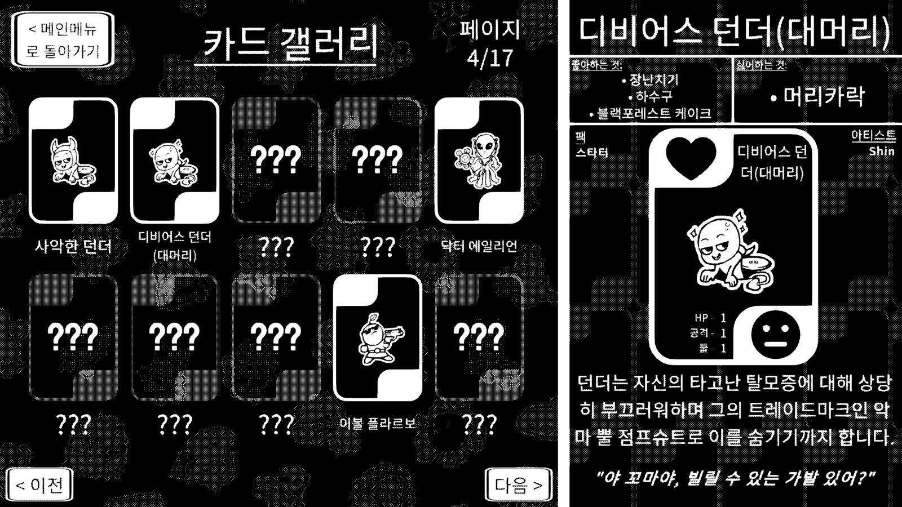

# Trading Card Inspector 한국어 패치

**Trading Card Inspector** 의 비공식 한국어 번역 패치입니다. BepInEx 플러그인 방식으로 동작하며, 게임 파일을 직접 수정하지 않습니다.

---

## 스크린샷




---

## 설치 방법

1. [Releases](../../releases) 에서 `TCI_Korean_Patch_vX.X.X.zip` 다운로드
2. 압축 해제 후 내용물을 게임 폴더에 그대로 복사

   **게임 폴더 기본 경로:**

   ```text
   C:\Program Files (x86)\Steam\steamapps\common\Trading Card Inspector
   ```

3. 게임 실행

> 기존에 BepInEx가 설치되어 있어도 충돌 없이 덮어씌워집니다.

---

## 제거 방법

게임 폴더에서 아래를 삭제하세요:

```text
BepInEx\plugins\TCIKorean\
```

BepInEx 자체를 완전히 제거하려면 `winhttp.dll`, `doorstop_config.ini`, `BepInEx\` 폴더를 삭제하세요.

---

## 번역 수정 / 기여

번역이 어색하거나 오류가 있으면 [Issues](../../issues) 에 제보해주세요.

`BepInEx\plugins\TCIKorean\strings_ko.json` 파일을 직접 수정해서 패치를 적용할 수도 있습니다. 게임을 재시작하면 반영됩니다.

---

## 기술 정보

- **방식:** BepInEx 5 플러그인 — Unity Localization StringTable에 런타임 주입
- **폰트:** Noto Sans KR (OFL 라이선스)
- **번역:** 자동 번역 후 수동 검수

## 라이선스

MIT License — 자세한 내용은 [LICENSE](LICENSE) 참조
